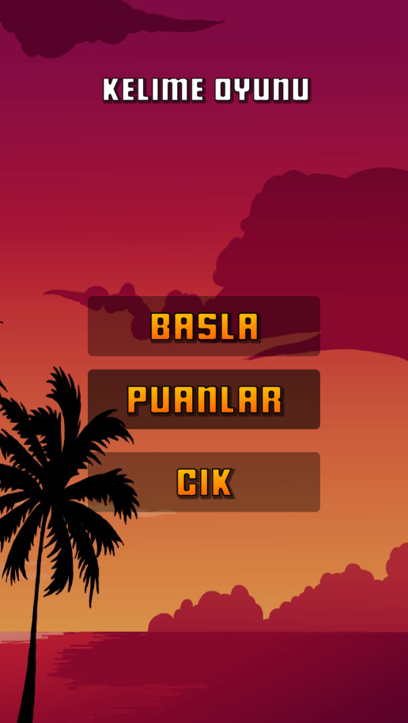
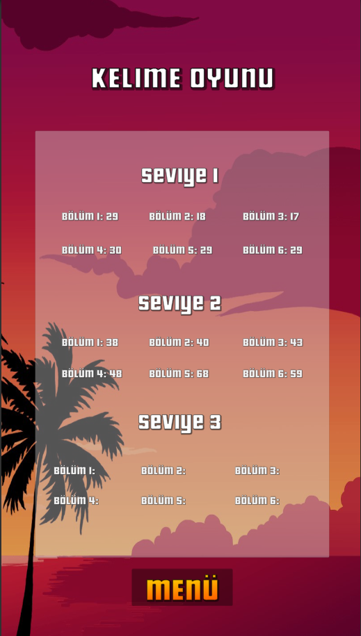
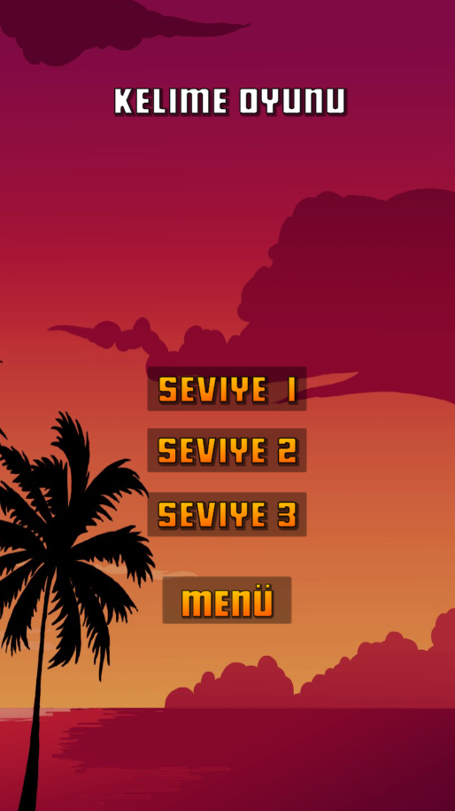
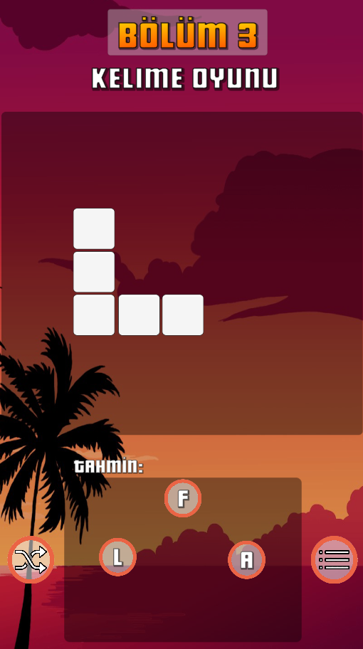
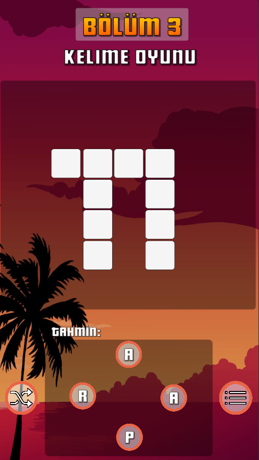
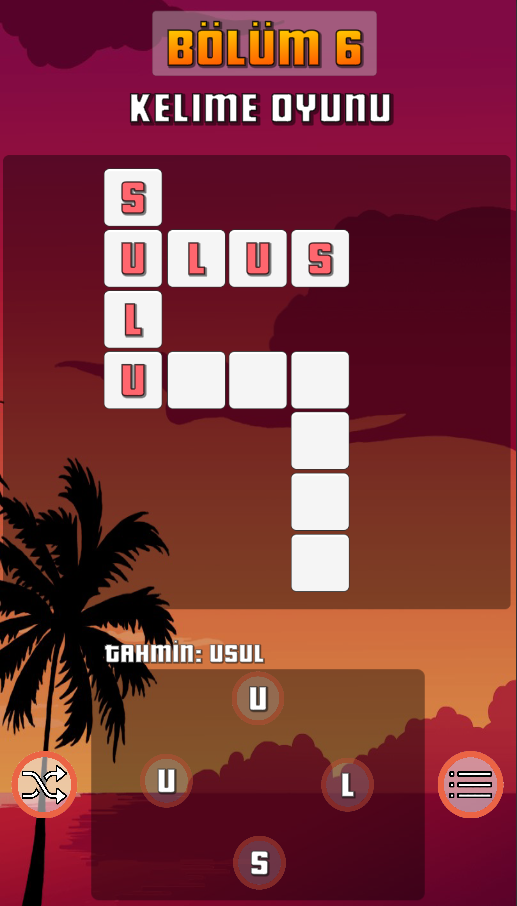

# Kelime Oyunu

## Projenin Amacı
[Words of Wonders](https://play.google.com/store/apps/details?id=com.fugo.wow&hl=en) oyununun bir benzerini yapmak.

## Oyun Seviyeleri ve Bölümleri
Oyun 3 seviyeden oluşuyor.
- 1.seviyede 3 harften oluşan kelimeler,
- 2.seviyede 4 harften oluşan kelimeler,
- 3.seviyede 5 ve üzeri harften oluşan kelimeler bulunuyor.

**Her seviyenin kendine ait 6 tane bölümü var. Oyunda toplamda 18 tane bulmaca bulunmakta.**

## Puanlama
Her doğru tahmin için harf başına oyuncuya 5 puan eklenir. Yanlış tahmin için her harf başına -1 puan verilir. Bölüm bittiğinde geçen zamanın yarısı eksi puan olarak eklenir ve seçilen seviyedeki, çözülen bölüm için toplam puan oluşur.

## Harf Yerini Değiştirme Butonu
Butona basıldığında tahmin etmede kullanılan harf butonlarının yeri değişir.

## Kelime Tahmin Etme
Herhangi bir harf butonuna basıldığında parmağı kaldırmadan diğer harfe gidilerek tahmin kelimesi oluşturulur. Parmağı kaldırdıktan sonra tahminin doğru olup olmadığı kontrol edilir.

## Ekran Görüntüleri
###### Ana Menü

 

###### Puan Tablosu
 

 

###### Seviye Menüsü
 

 

###### 1.Seviye Bulmaca
 

 

###### 2.Seviye Bulmaca
 

 

###### 3.Seviye Bulmaca
 

 

###### Örnek Tahminli Bulmaca
 

 
